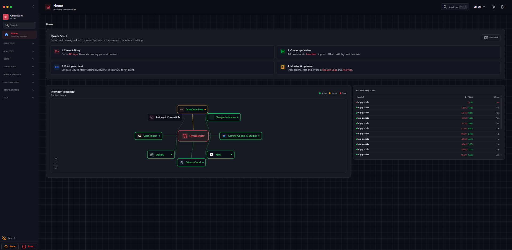
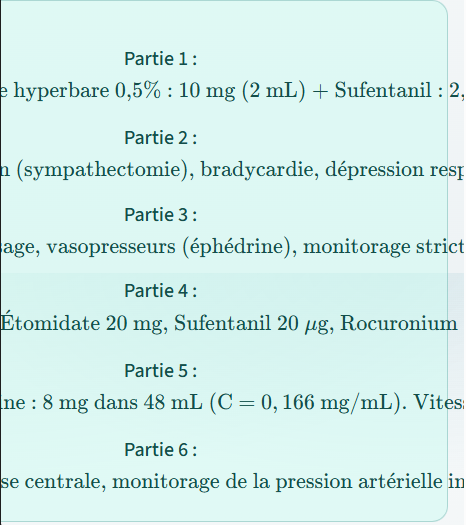
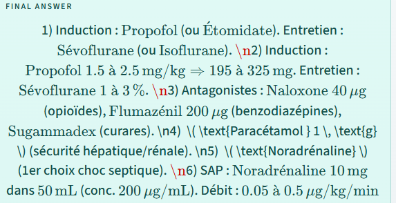
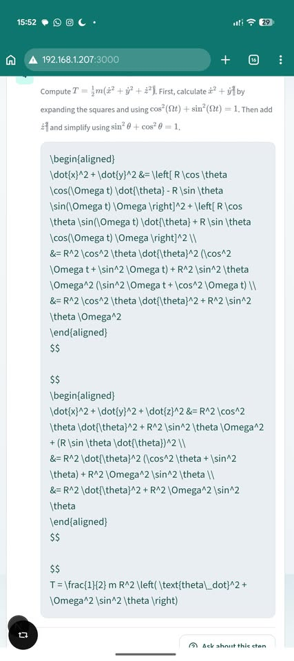

# Insights & Credentials

This page is meant to be for overall opinions I hold about the creation of this project, and the process of creating it. It is not meant to be a technical page, but rather a personal one. I will be documenting my thought process, errors that persisted and explained why I previously called this suprisingly harder then I had expected initally. 

I also delve into a debate I have had with myself, about whether vibecoding is a skill, and I come to a conclusion at the end.

##### ***Disclaimer***

***I, by no means, think vibecoding is harder than actual coding. The diverse and deep skillset of software development cannot be undermined/undervalued. With that being said, saying I didn't learn anything from this would be undermining me, as I did end up trying far more then I expected, albeit to what would've been a far less degree. In the pursuit of knowledge, I succeeded.*** 

 

### Financial Struggles with Omniroute

The first and biggest struggle was doing this with essentially no money. For most of the project I was using free AI models via omniroute and setting them up was tedious within itself. I say essentially because I caved in towards the end and chipped in $5 to an API key provider, only for it to be useless. I regret losing my badge of honour that I made it for free, and regret more that it didn't even help. 

What I did was use the free services, aswell as expend the usage on the premium models, of which OpenCode was the best by far. 

### Repeated Errors

  

 The biggest problem when creating the website was syntax errors, or answers going over the text box, as this was something that would repeat many times over. As with working with AI, the same issue is bound to pop up many times, and given I wanted to stress-test my model, I dedcided to give it some of the hardest work I could find, only to see "it is now fixed, this won't prevail" only for it to previal for the 17th time. It forced me to dive deeper into the code of my website.

 ### Skillset Development

 While I didn't necessarily code, I learnt how AI works far better. I understood basic knowledge albeit, such as how API keys work, and had "hands-on" experience working with LLM's directly. Using cheaper models meant I couldn't just throw prompts how I wanted. All knowledge that is fundimental, but I wouldn't have known unless I pursued this project. 

 Overall, there was a lot more managerial perspective to developing this website, which I enjoyed and saw develop further.

 ### Would I recommend this & Conclusions

 100%. This is something which has been fun, educational and genuinely useful to me at least, it gives a newfound perspective and respect for web development, and lets you see the difference between a website made by AI and a website made by person. 

 To speak more on if vibecoding is a skill, I will say that it is by far, easier and carries an entirely different skillset to coding manually. Instead of learning how to code, you are managing and coordinating many LLM's accordingly, to make sure that you dont exceed your tokens as per one example, specifically when using Omniroute. 

 I believe it is ***not*** a skill in of itself, but it does develop other skills. However, the most important aspect of vibecoding is that you can learn, and you gain knowledge in different aspects. Also, it is very efficient, and sparks a whole new debate on whether it will become standard practice in the future.

 ## Credits

 IPITSM (2026). Test image used . [Test image 2](./test-question2.jpeg)

 University of Exeter (2025). Mathematics for Physicists PHY 1026 . [Showcase 2](./showcase2.png)

