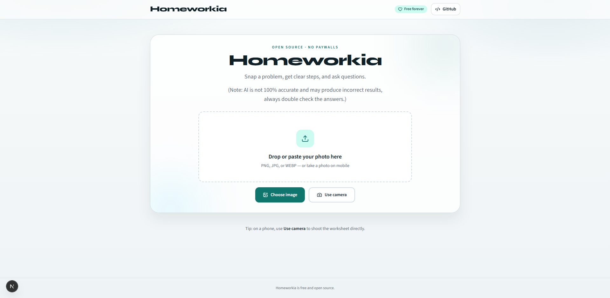
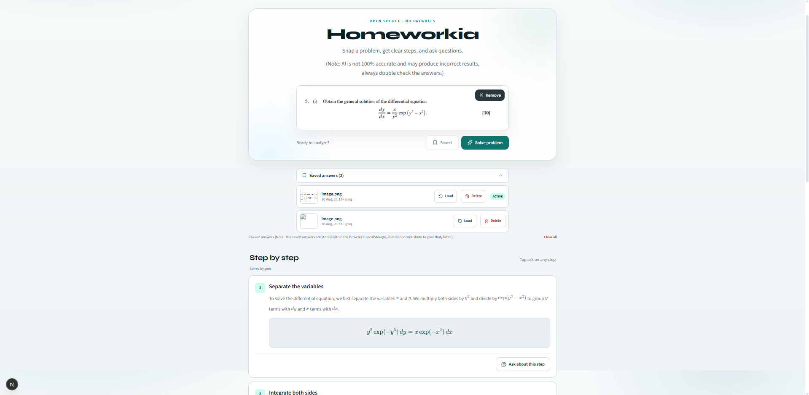
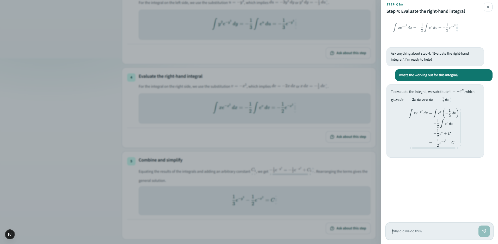
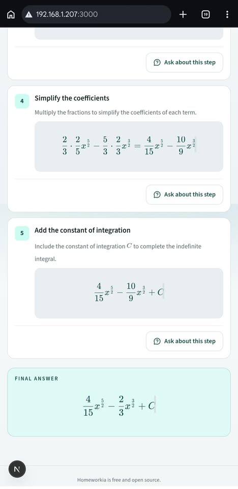

# Homeworkia

Throw your problem, get a step-by-step solution and ask whatever questions about the process. Works on mobile too

## Motivations & Morals

**This website is entirely free**, cost me £3.50 (costs are discussed in Insights) to make and **100% open sourced**. I intend to use it for my own personal use as I am studying my degree. It is supposed to be universal, however **excels in maths/physics**, with a lot of the stress testing being using my homework or, the homework of a very generous emergency nursing student in Morocco.

**Homeworkia is *vibecoded***, pretty obviously too. However, it has still been a fun process, with its own set of challenges. Despite barely interfering in the coding process, I have had to do a lot more than I initially expected [Insights](./Insights.md). (I also discuss the debate on whether vibecoding is a skill or not, I'd strongly recommend checking it out).

*The technical part of this all comes next, such as the setup and the tools used, this is just to introduce and give an idea as to where this came from.*
## Tech Stack

- Next.js (App Router)
- Tailwind CSS
- react-dropzone (desktop drop + mobile camera)
- Lucide icons
- KaTeX via `react-katex`
- Omniroute (Multi-provider vibecoding agent)

## Current status

Currently, the Scaffolding and responsive UI uses **mock solve data** to verify the layout. The use of AI is accomplished via Groq Qwen 3.6 27B, Gemini 3.7 Flash and Cloudfare API, limited to both models previously aforementioned

*Note: Omniroute was strictly for vibecoding/creation and not needed in the actual live application itself*

## Getting started

1. Clone and installation:

```bash
git clone https://github.com/Abdxllxh-07/homeworkia.git
cd homework-ia

npm install
```
2. Create an .env.local file (or open up and rename the env.example file) in the root directory based on your expected keys.

```code snippet
GROQ_API_KEY=[YOUR_GROQ_API_KEY]
GEMINI_API_KEY=[YOUR_GEMINI_API_KEY]
CLOUDFLARE_API_KEY=[YOUR_CLOUDFLARE_API_KEY]
CLOUDFLARE_ACCOUNT_ID=[YOUR_CLOUDFLARE_ACCOUNT_ID]
```
3. Run the development server

```
npm run dev
```


Open [http://localhost:3000](http://localhost:3000).

## Planned API

`POST /api/solve` — accepts `{ imageBase64 }` and will return:

```json
{
  "problemText": "...",
  "finalAnswer": "...",
  "steps": [
    {
      "stepNumber": 1,
      "title": "...",
      "explanation": "...",
      "mathFormula": "..."
    }
  ]
}
```

Right now the route returns mock data so the contract is in place.

## Showcase







### *Note: contributions, issues and feature requests are welcomed!*
